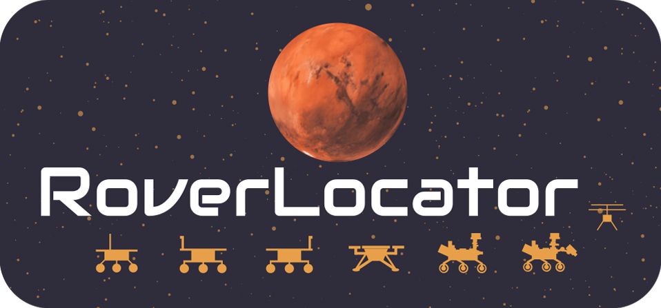

Get the local time and weather, when available, for Rovers on Mars!

Below you can check a screen recording of the UX:

Mars texture from Viking images, processed at the USGS from the database of JPL/Caltech generated planetary maps.

This PWA was created to start learning about WebGL. It connects to NASA's public APIs.